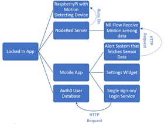
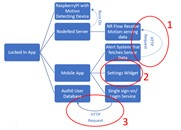
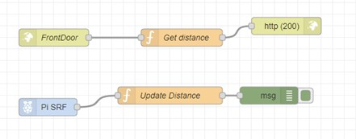

# Locked In

## Executive Summary
The home is many things, but above all it is the place we keep the mementos and objects that make life worth living. Loved ones, expensive devices and appliances, irreplaceable memories… These make up the most essential and important objects in life, and as much as we wish we could guarantee the safety and security of these pieces of our lives, there are great risks to the things we hold nearest our hearts. At some point the home must be left unattended. The goal of Locked In is to create a place to give homeowners peace of mind in leaving their residence, providing a minimalistic defense implementation that will take a monumental step toward protecting the home.

Locked In is a project that will be comprised of a few simple components that will make securing the home a much simpler task.

## Project Goals
* Give users peace of mind in leaving their homes.
* Secure entrances using motion sensing device.
* Provide a log of entrance uses for creating timeline.

## Project Merit
A world where the home is more secure is clearly one that benefits society. This application would be beneficial to homeowners of all walks of life, providing an instantaneous alert system that would allow users to monitor any activity around the home, as well as give users an exact time to provide to authorities in case a burglary occurs.

## User stories
As a homeowner, I want to secure the entrances to my household so that I know when an entrance is used.

**Acceptance Criteria:**
* Given I have set up the device at an entrance, when the entrance is used then an alert will be sent to the user’s device stating which one and when

As a homeowner, I want to know the exact times an entrance is used so that I can create a timeline of when my house was robbed.

**Acceptance Criteria**
* Given that a door has been used, when the alert comes up, then the user will be prompted to record the entrance usage or confirm that it was authorized.

## Misuser stories
As a home burglar that is aware the system is in place, I want trick the system into believing nothing is happening by holding something in front of the sensor so that I can enter the home without notifying the owner.

**Mitigations**
* The accepted error of the motion sensor will be limited to 3 centimeters, a small enough value that it will be difficult to fool.
* Device will be installed on the inside so that no outsider can meddle with it.

As a burglar, I want to bypass the security system by opening and closing the door between sensor data fetches.

**Mitigations**
* The application will fetch the latest read every second, not enough time to open a door, sneak in, and close the door without tripping the alert to the app.

## High Level Design

## Component List
### Component 1: Raspberry Pi with Motion detecting Device
This component is all of the hardware involved in this project. Completes the physical collection of data and hosts the Node-RED server.

### Component 2: Node-RED Server
The Node-RED server is my choice to allow communication between the mobile app and the motion sensing device.

#### Sub-component 2.1: Node-RED Flow
On the Node-RED server there will be a flow designed to check motion data constantly to allow the mobile app to always have the most up to date information when it requests it.

### Component 3: Mobile App
This component is the client-side application, so this is what each end user will see using the app.

#### Sub-component 3.1 Alert System
This portion of code will access the Node-RED server, find the newest reading of distance and compare it with the previous reading, and will alert the user if change occurs.

#### Sub-component 3.2 Settings Widget
This sub-component will allow the user to set up the HTTP connection between the Node-RED server and the mobile app by customizing the IP address that it fetches motion sensor data from.

#### Sub-component 3.3: Single Sign-On / Login Service
This feature will allow a specific account to be associated with a device and save the entry log through a sign in to the auth0 user database associated with this project.

### Component 4: Auth0 User Database
This component hosts a user database for the Locked In app, allowing users to login and see the log of most recent entries.

## Security analysis

| Component name | Category of vulnerability | Issue Description | Mitigation |
|----------------|---------------------------|-------------------|------------|
| Component 3.1 > Component 2 Alert System to Node-RED Server | Man-in-the-Middle Attack | The HTTP request made by the mobile app to the Node-RED server is through the HTTP protocol instead of using the HTTPS protocol that has the added security of a TLS handshake, so attacker can intercept data not assumed to be known to anyone but the user. | Retrieve a certificate to be able to protect accesses to the Node-RED server. |
| Component 3.2 Settings Widget | Wrong Information Exception | This widget will rely on user input to set the exact IP address to fetch user data from, and could cause fatal issues within the application. | Include some validation code to ensure that a valid IP is included. |
| Component 3.3 > Component 4 Single Sign-on / Login Widget to Auth0 | Man in the Middle Attack | Again the HTTP request is in danger as it is actively reaching out into the internet, but this time this vulnerability is just to ensure the TLS handshake is occurring through Auth0 and no user information is visible. | Double check the packets are protected. |

## Installation Instructions
1. Download the app-release.apk file from this repository.
2. Open the Application.

## Getting Started
1. Download the Application (app-release.apk).
2. Acquire Raspberry Pi 3 B+ Model (with OS installed on MicroSD) and HC-SR04 Ultrasonic Distance Sensor Module.
3. Install the Pi and Sensor within close range of the entry to be monitored. It is recommended that the sensor be entirely stationary and within a close proximity to the door to get best results.
4. Power on Raspberry Pi and follow: https://learn.adafruit.com/raspberry-pi-hosting-node-red/. Note the port that is chosen to Run Node-RED and the IP address of the Pi.
5. Access the Node-RED server and import the flows.json file form the SubmissionMetadata folder of this repository. It should look like this:
 Take note of the URL entry of the 'http in' node.
6. Open the app, login to Auth0, enter the configurations that YOU customized: Pi IP address, Port of the Node-RED server, and the route that was noted last step. 
7. Attain peace of mind as the Entryway is now under constant watch through Locked In!

